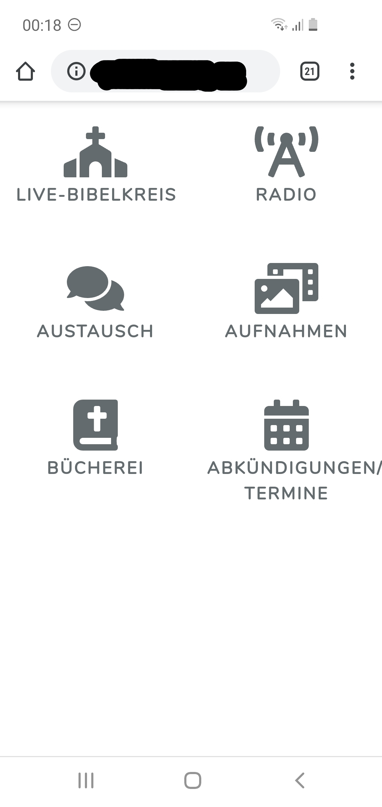

 TODO logo idea: ice-brick texture 
 

 &nbsp; &nbsp;  

## About Chaba

Chaba is an app supporting online expansion of 'church' in its broadest sense. It comprises 

- streaming church services through common desktop and mobile web-browsers using hls (latency 15s) and 
   rtmp (flashvideo, with latency of 2s, but which has fewer browser compatibility).
    For the streaming source, OBS can be used
- audio streaming church services 
- Chat area next to the streaming frame
- file manager area for up and download for in-browser playing of church service recordings
- authentication of church members and guests
- [Unfinished] Chat-App with User Management and user status management for encouraging communication between church memebers  
- [Unfinished] Management of "calendar" and "About"-contents of the app  

## Learning Chaba

Take a look into the INSTALL.txt to get insight into installation routine. For an overview of reused packages take a look
 into the docker-compose.yml. For now, as the app is still in alpha state, developer resources will pe put into development
 first, befor writing a thorough documentation

## Contributing

Thank you for considering contribution to the chaba online church app! 

## Code of Conduct

In order to ensure that the Laravel community is welcoming to all, please review and abide by the [Code of Conduct](https://laravel.com/docs/contributions#code-of-conduct).

## Security Vulnerabilities

If you discover a security vulnerability within chaba, please send a notification via my github account.

## License

The Chaba online church app is open-sourced software licensed under the [MIT license](https://opensource.org/licenses/MIT).
