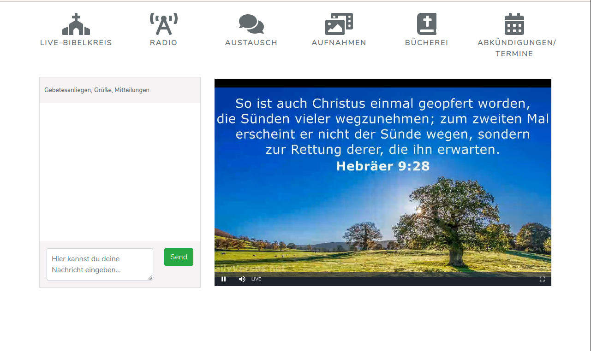

 TODO logo idea: ice-brick texture 
 

&nbsp; &nbsp; &nbsp; &nbsp; &nbsp; &nbsp;    

&nbsp; &nbsp; &nbsp; &nbsp; &nbsp; &nbsp;    

## About Chaba

Chaba (acr. for: chaba aids believer's assembly) is an app supporting churches to use digital capabilities for 
their gatherings and cooperations.
 It comprises 

- streaming church services through common desktop and mobile web-browsers using hls (latency 15s) and 
   rtmp (flashvideo, with latency of 2s, but which has fewer browser compatibility).
- audio streaming church services 
- Chat area next to the streaming frames
- file manager for up- and download of church service recordings and for in-browser playing of its contents
- authentication of church members, administrators and guests
- [Upcoming] Chat-App with User Management and user status management for encouraging communication between church members  
- [Upcoming] Management of "calendar" and "About"-contents of the app 

## Learning Chaba
A pictured documentation is planned for navigating you through all of chaba's features 

## Contributing

Thank you for considering contribution to the chaba online church app!   
In brief chaba integrates a couple of free tools to make an app to aid churches
in their digital struggle after corona lockdowns. For an overview of reused modules take a look
at the docker-compose.yml.

## Security Vulnerabilities

If you discover a security vulnerability within chaba, please send a notification via my github account.

## License

The Chaba online church app is open-sourced software licensed under the [MIT license](https://opensource.org/licenses/MIT).

# Installation

### Before you start
chaba occupies the ports 80 (webserver), 8000 (for video-streaming), 8008 (for webradio), 6001 (for websocket-communication) 
by default. Stop any other applications running on these ports or configure chaba for using other ports inside chabas .env file.

## STEP 1: prerequisite: install docker, docker-compose, nodejs, npm and git 
    sudo apt-get install docker-compose docker.io npm nodejs git
    sudo adduser `whoami` docker
    sudo systemctl enable docker
    sudo service docker restart

## STEP 2: install chaba and its dependencies
    git clone https://github.com/dioniswe/chaba.git chaba
    cd chaba
    composer install
    npm install
    npm run dev

### STEP 3 configure your chaba application.
 
Modify .env: set values for

    ICECAST_SOURCE_PASSWORD to authenticate audio streaming sources
    ICECAST_MOUNT_NAME for the audio streaming url path

    CHABA_ADMIN_USER for generating the chaba admin user (responsible for app contents of startpage and recordings)
    CHABA_ADMIN_PASSWORD  for setting the chaba admin password

    CHABA_CONGREGATION_USER for generating the chaba congregation user (the website user)
    CHABA_CONGREGATION_PASSWORD for setting the chaba congregation password
    
Bring up the containers finally

    docker-compose up -d

## STEP 4 after building, initialize your laravel application (as can be found in laravel quickstart guides)
    docker-compose run chaba php artisan key:generate
    sudo chown -R www-data:www-data .
    docker-compose run chaba php artisan migrate

## Step 5 (optional) install google fonts locally
    mkdir  public/vendor/fonts
    npm install -g google-font-installer
    gfi download Nunito -d public/vendor/fonts

# Usage

Stream to your 'Radio'-Section using any icecast2 compatible client (i.e Butt). In butt settings fill in your server's domain,
your configured port (default port: 8008) and your configured source authentication key

Stream to your 'Church-Service'-Section using any rtmp-compatible client (i.e OBS). In obs settings fill in your server's domain, 
your configured port (default port: 8000) and your configured streaming key (default key: stream_name)

Chatting works straight

For the recordings management an admin user has been created on laravel initialization who is privileged to upload files.
The congregation user is privileged to download and play files.

  

